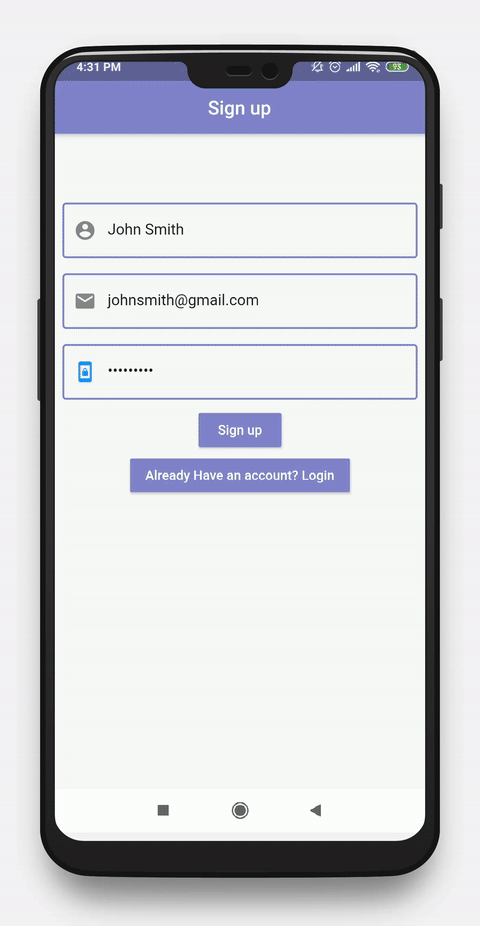

# Flutter-Firebase-Chat-App

[](https://nodesource.com/products/nsolid)


Chat application using push notification and real time database integrated in firebase.
# Features!
  - Signup using firebase authentication
  - Push notification integration with firebase
  - Real time firebase database for chat

### Application Behaviour


### Tech

Chat app uses a number of open source projects to work properly:

* [Flutter] - Mobile application development framework using Dart!
* [Visual Studio Code] - awesome text editor


### Installation

Chat App requires [Flutter](https://flutter.dev/) v1.0.0+ to run.

Install the dependencies and devDependencies.

```sh
$ flutter packages get
```

Start application...

```sh
$ flutter run
```

### Design Credit

Thanks to bravor chen
https://www.behance.net/gallery/35000415/chat-app-page |

### Contact us
We are working on flutter application
Email :- bhavin@saeculumsolutions.com 

### Development

Will work on new updates for complete application.

### Todos

 - Work with Group chat
 - Performance improvement

### License
----

MIT